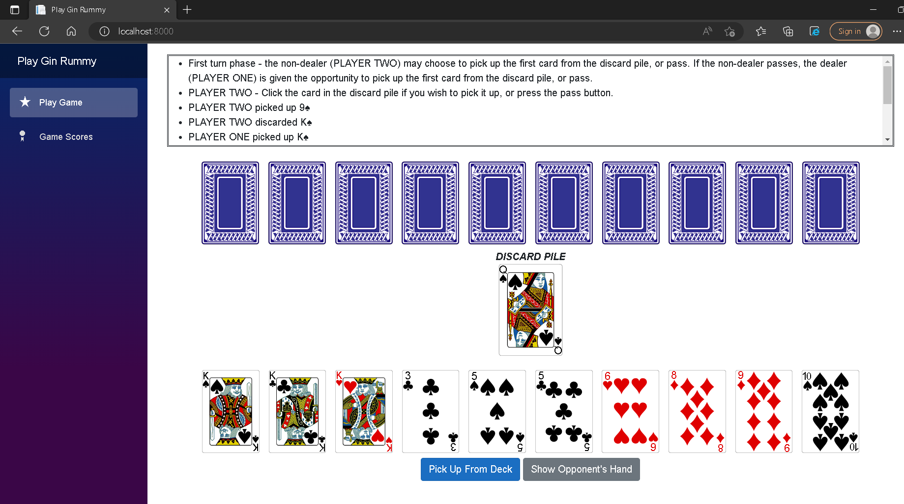

# BlazorGinRummy

This is a web app of a browser-based playable gin rummy game programmed in C# and Blazor WebAssembly. I reworked my [command-line playable version of gin rummy](https://github.com/ConkyTheGreat/Gin-Rummy-CLI) to be played with a browser UI and point/click commands. This version of the game always has the human play against the simple computer AI agent.

This web app can also be downloaded and ran via Docker:
- In a terminal, run `docker pull conkythegreat/gin-rummy-blazor`
- Run `docker run --publish 8000:80 conkythegreat/gin-rummy-blazor`
- In your web browser, navigate to `localhost:8000` and the web app should be running

Credit goes to Chris Sainty for providing instructions on [how to Dockerize a Blazor WebAssembly app](https://chrissainty.com/containerising-blazor-applications-with-docker-containerising-a-blazor-webassembly-app/).

